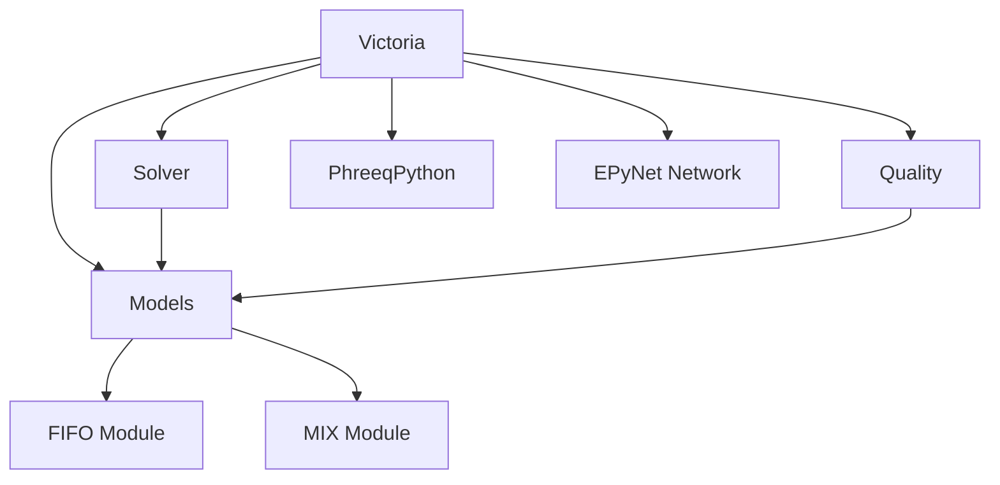

# victoria/fifo.py

The **FIFO** module implements **First In, First Out** tracking of water parcels through hydraulic links. It defines the fundamental data structures and operations for pipes, pumps, and valves.

- **Parcel**: A small volume of water with positional (`x0`, `x1`) and quality (`q`) attributes.
- **FIFO**: Base class managing parcel insertion, shifting, reversal, and readiness state.
- Supports:
  - **connections**: linking upstream/downstream nodes
  - **reverse_parcels**: handling flow direction changes
  - **push_in**: recursively adding incoming parcels
  - **state/output_state**: internal and outgoing parcel lists

```python
@dataclass
class Parcel:
    x0: float
    x1: float
    q: Dict[int, float]

    def to_dict(self) -> Dict[str, Any]:
        return {'x0': self.x0, 'x1': self.x1, 'q': self.q}

class FIFO:
    def __init__(self, volume: float = 0.0):
        self.volume = volume
        self.state: List[Dict[str, Any]] = []
        self.output_state: List[Dict[str, Any]] = []
        self.ready = False
        self.downstream_node = None
        self.upstream_node = None

    def connections(self, downstream: Any, upstream: Any) -> None:
        self.downstream_node = downstream
        self.upstream_node = upstream

    def reverse_parcels(self, downstream: Any, upstream: Any) -> None:
        reversed_state = []
        for parcel in self.state:
            reversed_state.append({
                'x0': 1 - parcel['x1'],
                'x1': 1 - parcel['x0'],
                'q': parcel['q']
            })
        self.state = sorted(reversed_state, key=lambda p: p['x1'])
        self.downstream_node = downstream
        self.upstream_node = upstream

    def push_in(self, volumes: List[List[Any]]) -> None:
        if not volumes:
            return
        v, q = volumes[-1]
        if self.volume <= 0:
            volumes.pop()
            if volumes:
                self.push_in(volumes)
            return
        fraction = v / self.volume
        self.state = [
            {'x0': s['x0'] + fraction, 'x1': s['x1'] + fraction, 'q': s['q']}
            for s in self.state
        ]
        # Merging or prepending new parcel omitted for brevity
```

---

# victoria/mix.py

The **MIX** module provides **mixing strategies** at network nodes. It defines how incoming parcels combine and distribute across outgoing links.

- **_get_links**: Unified access to `upstream_links`/`downstream_links` (method or property).
- **MIX (base class)**:
  - `merge_load`: weight‐merge two quality dictionaries
  - `parcels_out`: allocate mixed parcels by flow rates
- **Node models**:
  - **Junction**: ideal mixing with demand
  - **Reservoir**: source node, passes inflow unchanged
  - **Tank_CSTR**: continuous stirred tank reactor
  - **Tank_FIFO**, **Tank_LIFO**: first‐in‐first‐out or last‐in‐first‐out stratified tanks

```python
class MIX:
    def __init__(self):
        self.sorted_parcels: List[Dict[str, Any]] = []
        self.outflow: List[List[List[Any]]] = []
        self.mixed_parcels: List[Dict[str, Any]] = []

    @staticmethod
    def merge_load(dict1: Dict, dict2: Dict, volume: float) -> Dict:
        result = dict1.copy()
        for key, val in dict2.items():
            result[key] = result.get(key, 0) + val * volume
        return result

    def parcels_out(self, flows_out: List[float]) -> None:
        self.outflow = []
        total = sum(flows_out)
        if total <= 1e-7:
            return
        for flow in flows_out:
            temp = []
            for parcel in self.mixed_parcels:
                vol = (parcel['x1'] - parcel['x0']) * flow / total * parcel['volume']
                temp.append([round(vol, 6), parcel['q']])
            self.outflow.append(temp)

class Junction(MIX):
    def mix(self, inflow: List[Dict[str, Any]], node: Any,
            timestep: float, input_sol: Any) -> None:
        # Sort by position, apply demand, merge loads, then parcels_out
        pass
```

---

# victoria/models.py

The **Models** module auto‐creates and manages **model instances** for every network component, linking EPyNet objects to FIFO/MIX behavior.

- **load_links**: for each `pipe`, `pump`, `valve` in the network, instantiate corresponding FIFO model (`Pipe`, `Pump`, `Valve`).
- **load_nodes**: for each `junction`, `reservoir`, `tank`, assign a MIX model (`Junction`, `Reservoir`, `Tank_CSTR` by default).
- **get_node_model** / **get_link_model**: lookup functions raising `KeyError` if not found.

| Network Element | Model Class      | Storage Dict       |
| --------------- | ---------------- | ------------------ |
| Pipes           | `Pipe`           | `self.pipes`       |
| Pumps           | `Pump`           | `self.pumps`       |
| Valves          | `Valve`          | `self.valves`      |
| Junctions       | `Junction`       | `self.junctions`   |
| Reservoirs      | `Reservoir`      | `self.reservoirs`  |
| Tanks           | `Tank_CSTR`      | `self.tanks`       |

```python
class Models:
    def __init__(self, network: Any):
        self.nodes = {}
        self.pipes = {}
        self.links = {}
        self.load_links(network)
        self.load_nodes(network)

    def load_links(self, network: Any) -> None:
        for pipe in network.pipes:
            vol = 0.25 * math.pi * pipe.length * (pipe.diameter * 1e-3)**2
            self.pipes[pipe.uid] = Pipe(volume=vol)
            self.links[pipe.uid] = self.pipes[pipe.uid]
        # Similar for pumps and valves...
```

---

# victoria/quality.py

The **Quality** module handles **water chemistry** calculations, using PHREEQC to mix solutions and compute concentrations and properties.

- **get_parcels**: retrieves current parcels in a pipe.
- **get_conc_node / get_conc_node_avg**: instantaneous and time‐averaged concentration at a node.
- **get_mixture_node / get_mixture_node_avg**: solution fraction mappings (instant and averaged).
- **get_conc_pipe / get_conc_pipe_avg**: concentration profile and volume‐averaged concentration in a pipe.
- **get_properties_node / get_properties_node_avg**: pH, conductivity, temperature at node exit.

```python
class Quality:
    def __init__(self, pp: Any, models: Any):
        self.pp = pp
        self.models = models

    def get_conc_node(self, node: Any, element: str, units: str = 'mmol') -> float:
        node_model = self.models.nodes.get(node.uid)
        if not node_model or not node_model.mixed_parcels:
            return 0.0
        parcel = node_model.mixed_parcels[0]
        return self._calculate_concentration(parcel['q'], element, units)

    def _calculate_concentration(self, sol_dict: Dict[int, float],
                                 element: str, units: str) -> float:
        mixture = self._mix_phreeqc_solutions(sol_dict)
        return mixture.total(element, units) if mixture else 0.0
```

---

# victoria/solver.py

The **Solver** module traces **water parcels** through the network based on hydraulic results.

- **_get_links / _get_node_attr**: compatibility layers for EPyNet API differences.
- **run_trace**: recursively mixes outflow from upstream links at each node.
- **fill_network**: seeds the network with initial solutions from reservoirs.
- **reset_ready_state**: clears link readiness for the next timestep.

```python
class Solver:
    def __init__(self, models: Any, network: Any):
        self.models = models
        self.net = network
        self.filled_links = []

    def _get_links(self, node: Any, direction: str) -> list:
        links = getattr(node, f'{direction}_links')
        return links() if callable(links) else links

    def run_trace(self, node: Any, timestep: float, input_sol: Any) -> None:
        upstream = self._get_links(node, 'upstream')
        if not all(self.models.links[l.uid].ready for l in upstream):
            return
        inflow = sum((self.models.links[l.uid].output_state for l in upstream), [])
        self.models.nodes[node.uid].mix(inflow, node, timestep, input_sol)
        # Mark downstream links ready omitted for brevity

    def fill_network(self, emitter: Any, input_sol: Any) -> None:
        # Recursive filling logic omitted for brevity
        pass
```

---

# victoria/victoria.py 🚀

The **Victoria** class provides the **high-level API**, orchestrating:

- **Models**: linking EPyNet components to simulation models
- **Solver**: tracing parcels
- **Quality**: computing chemistry

Main methods:

- **__init__(network, pp)**: set up `Models`, `Solver`, `Quality`.
- **fill_network(input_sol, from_reservoir=True)**: initialize all pipes with starting solutions.
- **step(timestep, input_sol)**: perform one quality simulation step; must follow hydraulic solve.
- **check_flow_direction()**: adapt to flow reversals across all links.
- **garbage_collect(input_sol)**: clean up unused PHREEQC solutions.

```python
class Victoria:
    def __init__(self, network: Any, pp: Any):
        self.net = network
        self.pp = pp
        self.models = Models(network)
        self.solver = Solver(self.models, network)
        self.quality = Quality(pp, self.models)

    def fill_network(self, input_sol: Dict, from_reservoir: bool = True) -> None:
        if from_reservoir:
            for res in self.net.reservoirs:
                self.solver.fill_network(res, input_sol)
        else:
            # Fill all pipes with background solution
            pass

    def step(self, timestep: float, input_sol: Dict) -> None:
        if timestep <= 0:
            raise ValueError("Timestep must be positive")
        for res in self.net.reservoirs:
            self.solver.run_trace(res, timestep, input_sol)
        self.solver.reset_ready_state()
```

---

## Module Interaction Overview



This flowchart shows how **Victoria** orchestrates the **Models**, **Solver**, and **Quality** components, which in turn depend on the underlying **FIFO** and **MIX** modules, as well as external **Epynet** and **PHREEQC** engines.