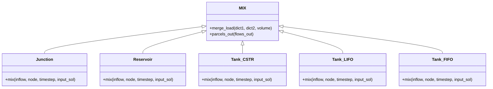
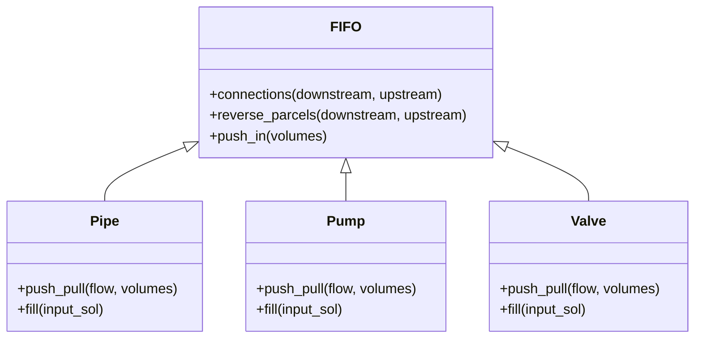

# Victoria Water Quality Simulator Documentation

Victoria is a Python package for simulating water quality in hydraulic distribution networks. It couples PHREEQC-based water chemistry with EPyNet hydraulic simulations, enabling detailed tracking of chemical constituents and mixtures as water moves through pipes, pumps, valves, and storage tanks.

---

## `mix.py` – Mixing Strategies for Nodes

This module implements mixing models for hydraulic network nodes—junctions, reservoirs, and tanks. It provides several physical models for water parcel mixing, allowing flexible simulation according to real-world behavior.

### Key Classes and Functions

| Class        | Purpose                                                         |
|--------------|-----------------------------------------------------------------|
| `MIX`        | Base class for mixing parcels at nodes.                         |
| `Junction`   | Ideal mixing at junctions, considers demand and inflow parcels. |
| `Reservoir`  | Reservoir node as a constant source; supplies parcels directly. |
| `Tank_CSTR`  | Tank as a Continuous Stirred Tank Reactor (full mixing).        |
| `Tank_LIFO`  | Tank as Last-In-First-Out (stratified, newest on top).          |
| `Tank_FIFO`  | Tank as First-In-First-Out (oldest leaves first).               |

#### MIX (Base Class)

- **merge_load**: Merges two solution dictionaries by volume.
- **parcels_out**: Distributes mixed parcels to outgoing links based on flows.

#### Junction

- **mix**: Merges inflow parcels, subtracts demand, and prepares outflow for each downstream link.

#### Reservoir

- **mix**: Generates new solution parcels based on reservoir's outflow and upstream chemical input.

#### Tank_CSTR

- **mix**: Implements ideal mixing using an exponential decay model in tank.
- Retains previous mixture, calculates new mixture based on inflow and tank volume.

#### Tank_LIFO

- **mix**: Stratifies parcels so that the most recent inflow is at the top; parcels leave in a LIFO order.

#### Tank_FIFO

- **mix**: Maintains parcel entry order; oldest parcels exit first (FIFO).

### Mixing Model Class Architecture



---

## `fifo.py` – FIFO Parcel Tracking for Links

This module models pipes, pumps, and valves using a First-In-First-Out (FIFO) approach for water parcels.

### Core Components

| Class    | Description                                                              |
|----------|--------------------------------------------------------------------------|
| `Parcel` | Represents a water parcel (position and chemical quality).               |
| `FIFO`   | Base class for links supporting FIFO water parcel tracking.              |
| `Pipe`   | Models a pipe; moves parcels according to flow, pushes/pulls parcels.    |
| `Pump`   | Models a pump (zero-length, instantaneous passage of parcels).           |
| `Valve`  | Models a valve (zero-length, instantaneous passage of parcels).          |

#### FIFO (Base Class)

- **push_in(volumes)**: Pushes inflow parcels into the link, shifting existing parcels.
- **reverse_parcels**: Reverses parcel positions if flow reverses.
- **connections**: Sets upstream and downstream node connections.

#### Pipe

- **push_pull(flow, volumes)**: Pushes parcels in based on inflow, calculates exited parcels.
- **fill(input_sol)**: Fills the pipe with a uniform solution.

#### Pump & Valve

- **push_pull(flow, volumes)**: Passes inflow parcels directly to outflow, no storage.
- **fill(input_sol)**: Initializes with a solution (for initial condition).

### FIFO Link Class Architecture



---

## `models.py` – Network Model Construction

This module organizes the hydraulic network into node and link models, preparing the entire network for simulation.

### Main Class: `Models`

- **Purpose:** Maintains all nodes and links, creating the correct mixing (MIX) and FIFO models for every network component.
- **Key attributes:** 
  - `nodes`, `links`: Dictionaries of all nodes/links.
  - `junctions`, `reservoirs`, `tanks`, `pipes`, `pumps`, `valves`: Typed dictionaries.

### Functions

- **__init__(network):** Scans network, creates models for each node and link.
- **load_nodes(network):** Builds node models (Junction, Reservoir, Tank).
- **load_links(network):** Builds link models (Pipe, Pump, Valve).
- **get_node_model(node_uid):** Retrieves a node model by unique ID.
- **get_link_model(link_uid):** Retrieves a link model by unique ID.

---

## `quality.py` – Water Quality Calculation

Handles mixing of PHREEQC solutions and retrieves concentration/properties at nodes and pipes.

### Main Class: `Quality`

| Method                  | Description                                                             |
|-------------------------|-------------------------------------------------------------------------|
| `get_parcels(link)`     | Returns all parcels in a pipe.                                          |
| `get_conc_node(node, element, units)` | Instantaneous concentration at node exit.             |
| `get_conc_node_avg(node, element, units)` | Time-averaged concentration at node.             |
| `get_mixture_node(node)` | Solution mixture fractions at node exit (instantaneous).               |
| `get_mixture_node_avg(node)` | Time-averaged solution mixture at node.                         |
| `get_conc_pipe(link, element, units)` | Concentration profile along a pipe.                   |
| `get_conc_pipe_avg(link, element, units)` | Volume-averaged concentration in a pipe.         |
| `get_properties_node(node)`           | pH, conductivity, temperature at node (instant).      |
| `get_properties_node_avg(node)`       | Time-averaged water properties at node.               |

#### Chemistry Handling

- Solution mixing leverages the PHREEQC Python interface.
- Chemistry is calculated by merging solution dictionaries and invoking PHREEQC's mix and total methods.

---

## `solver.py` – Water Quality Calculation Loop

The solver implements the main algorithm for tracking water parcels through the network according to hydraulic simulation results.

### Main Class: `Solver`

| Method                     | Description                                                        |
|----------------------------|--------------------------------------------------------------------|
| `run_trace(node, timestep, input_sol)` | Traces water parcels recursively from a node.         |
| `check_connections()`      | Checks for flow reversals, reverses parcels if needed.             |
| `fill_network(node, input_sol)` | Fills the network from a source node with initial solutions. |
| `reset_ready_state()`      | Resets all links' ready state for next simulation step.             |

#### Key Features

- Recursively tracks the movement and mixing of water parcels node-to-node, link-to-link.
- Handles flow reversals and ensures parcels are reversed when flow direction changes.
- Fills the network with initial conditions before time-stepping begins.

---

## `victoria.py` – High-Level Simulation API

This is the main module providing the user-facing API for water quality simulation.

### Main Class: `Victoria`

#### Initialization

```python
import epynet
import phreeqpython
from victoria import Victoria

network = epynet.Network('network.inp')
pp = phreeqpython.PhreeqPython()
vic = Victoria(network, pp)
```

#### Core Methods

| Method                     | Description                                                      |
|----------------------------|------------------------------------------------------------------|
| `step(timestep, input_sol)`| Advances water quality simulation by one timestep.               |
| `fill_network(input_sol, from_reservoir=True)` | Fills network with initial solutions.      |
| `check_flow_direction()`   | Updates internal state if flow directions change.                |
| `garbage_collect(input_sol=None)` | Removes unused PHREEQC solutions from memory.             |
| `get_conc_node(node, element, units='mmol')` | Instantaneous concentration at node exit.   |
| `get_conc_node_avg(node, element, units='mmol')` | Time-averaged concentration at node.    |
| `get_mixture_node(node)`   | Instantaneous solution mixture at node exit.                     |
| `get_mixture_node_avg(node)` | Time-averaged solution mixture at node exit.                  |
| `get_conc_pipe(link, element, units='mmol')` | Concentration profile along a pipe.         |
| `get_conc_pipe_avg(link, element, units='mmol')` | Volume-averaged concentration in pipe.   |
| `get_parcels(link)`        | All parcels in a pipe with position and quality.                 |
| `get_properties_node(node)` | pH, conductivity, temperature at node (instantaneous).          |
| `get_properties_node_avg(node)` | Time-averaged water properties at node.                  |

---

### Example Usage

```python
import epynet
import phreeqpython
from victoria import Victoria

# Load network and chemistry
network = epynet.Network('network.inp')
pp = phreeqpython.PhreeqPython()

# Create simulator
vic = Victoria(network, pp)

# Define input PHREEQC solutions (node UID -> solution object)
solutions = {...}
vic.fill_network(solutions)

# Advance simulation
for t in range(sim_steps):
    network.solve()  # Solve hydraulics for current step
    vic.step(timestep=3600, input_sol=solutions)  # One hour step

# Query node concentration
conc = vic.get_conc_node(node, 'Cl', 'mg/L')
```

---

## `__init__.py` – Package Initialization

This file initializes the package and exposes the main classes:

```python
from .victoria import Victoria
from .models import Models
from .solver import Solver
from .quality import Quality
from .fifo import FIFO, Pipe, Pump, Valve
from .mix import MIX, Junction, Reservoir, Tank_CSTR, Tank_FIFO, Tank_LIFO

__all__ = [
    'Victoria', 'Models', 'Solver', 'Quality',
    'FIFO', 'Pipe', 'Pump', 'Valve',
    'MIX', 'Junction', 'Reservoir', 'Tank_CSTR', 'Tank_FIFO', 'Tank_LIFO',
]
```

---

# API Endpoint Documentation

The Victoria package does **not** define HTTP API endpoints. Instead, it exposes a Python API with methods for simulation and querying. The following blocks describe the API methods and their usage.

---

## `Victoria.step` – Simulate One Timestep

### Advance Water Quality by One Timestep

```api
{
    "title": "Simulate One Timestep",
    "description": "Advance the water quality simulation by one timestep, updating water parcel chemistry according to hydraulic results.",
    "method": "python",
    "baseUrl": "victoria.Victoria",
    "endpoint": "step",
    "headers": [],
    "queryParams": [],
    "pathParams": [],
    "bodyType": "json",
    "requestBody": "vic.step(timestep=3600, input_sol=solutions)",
    "formData": [],
    "responses": {
        "None": {
            "description": "Simulation step completed."
        }
    }
}
```

---

## `Victoria.fill_network` – Initialize the Network

### Fill Network With Initial Solutions

```api
{
    "title": "Fill Network",
    "description": "Initialize the distribution network with starting water quality solutions.",
    "method": "python",
    "baseUrl": "victoria.Victoria",
    "endpoint": "fill_network",
    "headers": [],
    "queryParams": [],
    "pathParams": [],
    "bodyType": "json",
    "requestBody": "vic.fill_network(input_sol=solutions, from_reservoir=True)",
    "formData": [],
    "responses": {
        "None": {
            "description": "Network initialized with initial water quality."
        }
    }
}
```

---

## `Victoria.get_conc_node` – Query Node Concentration

### Get Instantaneous Concentration at Node

```api
{
    "title": "Get Node Concentration",
    "description": "Retrieve the instantaneous concentration of a chemical at a specific network node.",
    "method": "python",
    "baseUrl": "victoria.Victoria",
    "endpoint": "get_conc_node",
    "headers": [],
    "queryParams": [],
    "pathParams": [],
    "bodyType": "json",
    "requestBody": "vic.get_conc_node(node, 'Cl', 'mg/L')",
    "formData": [],
    "responses": {
        "float": {
            "description": "Concentration value at the specified node."
        }
    }
}
```

---

## `Victoria.get_conc_pipe` – Query Pipe Concentration Profile

### Get Concentration Profile Along Pipe

```api
{
    "title": "Get Pipe Concentration Profile",
    "description": "Retrieve the concentration profile of a chemical along the length of a pipe.",
    "method": "python",
    "baseUrl": "victoria.Victoria",
    "endpoint": "get_conc_pipe",
    "headers": [],
    "queryParams": [],
    "pathParams": [],
    "bodyType": "json",
    "requestBody": "vic.get_conc_pipe(pipe, 'Ca', 'mg/L')",
    "formData": [],
    "responses": {
        "list": {
            "description": "List of parcel dictionaries with position and concentration."
        }
    }
}
```

---

## `Victoria.garbage_collect` – Free Unused PHREEQC Solutions

### Remove Unused Solutions from Memory

```api
{
    "title": "Garbage Collect Solutions",
    "description": "Remove unused PHREEQC solutions from memory to prevent resource buildup.",
    "method": "python",
    "baseUrl": "victoria.Victoria",
    "endpoint": "garbage_collect",
    "headers": [],
    "queryParams": [],
    "pathParams": [],
    "bodyType": "json",
    "requestBody": "vic.garbage_collect(input_sol=solutions)",
    "formData": [],
    "responses": {
        "None": {
            "description": "Unused solutions removed from PHREEQC."
        }
    }
}
```

---

# Usage Notes

- **Nodes and links** are referenced by their unique IDs.
- **Input solutions** must be PHREEQC solution objects, referenced by node UID.
- Use **`step`** after each hydraulic time step to update water quality.
- Use **`get_...` methods** to query simulation results for nodes and pipes at any time.
- The **garbage collection** function is recommended for long simulations to manage memory.

---

```card
{
    "title": "Hydraulics Must Be Solved First",
    "content": "Call the Victoria step() method only after solving the hydraulic network for the current timestep."
}
```

---

```card
{
    "title": "Initial Conditions Required",
    "content": "Always call fill_network() before starting a simulation to set initial water quality conditions."
}
```

---

This documentation covers the structure, API, and usage patterns for Victoria, facilitating accurate and efficient water quality simulation in hydraulic distribution networks.
